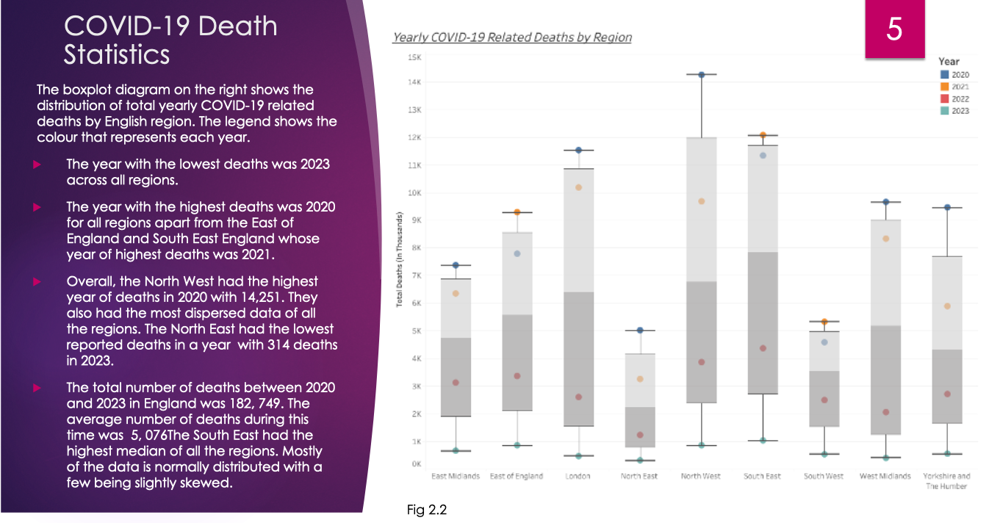

# <u>Python Projects</u>

## - Met Office Mean Temperature Prediction (current project)
  
**_Task Description:_** Many primary sectors depend on the weather for production, such as farming and energy. The climate is changing at drastic rates making old weather prediction methods less effective. To overcome these difficulties, improved and reliable weather prediction methods are required. These predictions affect a nation's economy and the lives of people. Machine learning is being increasingly implemented into weather services and climate research, increasing accuracy and providing new pathways to mitigation and adaptation. This project aimed to predict mean temperatures in London, to assess the ability of a range of machine learning models to accurately predict weather elements based on previous research findings.

**_Goal:_** To use machine learning pipelines to predict mean temperature (target variable) in London using minimum temperature, maximum temperature and rain (feature variables).

**_Technologies:_** Scikit-learn, pandas, matplotlin, seaborn and git version control.

**_Method:_** The project utilised open-source Met Office data downloaded from kaggle (https://www.kaggle.com/datasets/muthuj7/weather-dataset) to predict recent mean temperatures in London. 

Data preprocessing for this project involved exploring the data and identifying and handling missing values. Feature engineering techniques were also used to calculate the mean temperature to use as the target variable.

Exploratory data analysis was conducted, using descriptive statistics and visualisations to identify distributions, patterns, outliers, and correlations.

A research review conducted by Bogdan and Zbigniew (2022) suggested that the most common machine learning models used in weather prediction and climate science research were Deep Learning, Random Forest, Artifical Neural Networks, Support Vector Machine and XGBoost, respectively. Random Forest Regressor, Support Vector Regressor and XGBoost were selected to predcit mean temperature in London. Experimental hyperparameter tuning took place to optimise model performance and the evaluation strategy consisted of using cross validation (k=5) and evaluation metrics including MSE, MAE, RMSE and R2.

This is my current project, if you would like to see my code please follow the link below to the repository for the latest version.

**_Outcome:_** 

**_Improvements:_** 

**_Link to code:_** [Met Office Mean Temperture Prediction](https://github.com/CoetseeM/Met-Office-Temp-Prediction)

 
 

## - London Crime Analysis and Prediction
  
**_Task Description:_** Create a data science project with at least 800 lines of code and a 15,000 word report on a project of your choosing or from the list of suggested projects by supervisors. I decidedto conduct my own project and intitally wanted to look at increasing diversity in the outdoors, however I was unable to use the data in the end so decided to look at crime rates in London based on socio-economic factors instead. 

**_Goal:_** Utilise data analysis and machine learning techniques to:
1. Identify the trends in overall crime between 2011 and 2021 in London and provide
potential explanations.
2. Identify the crimes types that most affected London between 2011 and 2021.
3. Identify the monthly trends in the top 5 major crime types that affected London
between 2011 and 2021.
4. Identify the boroughs with the highest and lowest overall crime rates while taking
into account population size.
5. Investigate whether socio-economic factors such as unemployment rate
(percentage), annual income (median), people earning below the London Living
Wage (percentage) and population density by square kilometer are effective in
predicting overall crime in London using machine learning models.

**_Technologies:_** Scikit-learn, pandas, numpy, matplotlib, seaborn and Tableau.

**_Method:_** The project utilised open-source data from the London Datastore to analyze crime rates in London boroughs. Various socio-economic factors, such as population density, median earnings, unemployment rates, and percentage of people earning under the London Living Wage (LLW) were collected and processed to understand their impact on crime rates.

Data preprocessing involved handling missing values, removing duplicates, standardising column names, and aggregating data by borough and time period. Feature engineering techniques were applied to calculate adjusted crime rates considering borough population sizes.

Exploratory data analysis was conducted using descriptive statistics and visualisations to identify patterns, outliers, and correlations among variables. Multiple copies of the dataset were created with normalization and outlier handling to observe their effects on predictive model performance.

Predictive modeling was performed using machine learning algorithms such as Random Forest Regressor and Support Vector Regression. Hyperparameter tuning and cross-validation were employed to optimise model performance, with evaluation metrics including MSE, MAE, RMSE, R2, MBD, and learning curve analysis.

The Random Forest Regressor emerged as the best-performing model, explaining 80.4% of the variance in London crime rates. Population density was identified as the most significant predictor of crime rates, followed by median income, according to Random Forest Regressor's feature importance analysis.

**_Outcome:_** A 15,000 word academic journal article written in Latex for my MSc Data Science final project, I recieved a high distinction (76%).

**_Improvements:_** Due to time contraints I was only able to look at overall crime rates in London but to further improve this project I would look at the influence that soci-economic factors play on specific crimes in London and I would try to find more open source socio-economic factor data measuring things like inequality and average household income. I also think it would be interesting to observe the effects of weather on crime rates. Furthermore, I would break up the code into different notebooks such as cleaning and processing, exploratory analysis, models etc rather than one long notebook of code to make it easier for others to read.

**_Link to code:_** [London Crime Analysis and Prediction](https://github.com/CoetseeM/Final_Project)

 
 

## - Bank Customer Churn, Analysis and Classification

**_Task Description:_** Design a pipeline, an evaluation strategy, and a set of experiments to determine the best parameters and machine learning algorithm, based on the results of empirical evaluations derived from a dataset, compare different algorithms. 

**_Goal:_** A business manager of a consumer credit card portfolio is facing the problem of customer attrition. They want to analyse the data to find out the reason behind this and leverage the same to predict customers who are likely to drop off.

**_Technologies:_** Pandas, numpy, scikit-learn, matplotlib.

**_Method:_** 
Dataset Overview: The dataset comprised credit card portfolios of 10,127 customers, containing 21 features including numerical and categorical variables.

Data Preprocessing: Preliminary analysis revealed no null values in the dataset. Categorical features were one-hot encoded, while ordinal features were encoded based on predefined categories. Feature engineering techniques were applied to create new features or modify existing ones.

Data Splitting: The dataset was split into training and test sets using an 80/20 ratio.

Data Transformation: Numerical features underwent standardisation to bring them to a common scale, improving the model results.
Model Selection and Evaluation: Random Forest and Support Vector Classifier (SVC) models were selected for predicting churn. Model hyperparameters were tuned, and performance was evaluated using accuracy, precision, recall, and F1-score metrics which are commonly used for classification tasks.

**_Outcome:_** A detailed and concise academic style report, meticulously documenting each step of the process, I recieved a high distinction (81%).

**_Improvements:_**
-I would use cross validation to improve this project as this is industry standard and more reliable in model evaluation.

-I would experiment more with ensemble models such as Adaboost as these models can handle class imbalances.

**_Link to code:_** [Bank Customer Chrun](https://github.com/CoetseeM/Customer-Churn-Prediction)

 
 

# <u>Tableau Projects</u>

## - COVID-19 Vaccinations and Death Rates

**_Task Description:_** Using NHS open source data explore how the vaccines effected COVID-19 hospital admissions and deaths in England.

**_Goal:_** 
1. How do weekly admissions and weekly deaths compare following the first COVID-19 vaccine in England?
2. How do admissions and deaths differ by year and English Region?
3. Do weekly deaths decrease following the first vaccine in England?
4. Which regions in England had the highest number of deaths each year?
5. How did lockdowns effect admissions and death rates in England?
6. How do total admissions and deaths compare weekly across all of England?
7. How do vaccine roll outs effect admissions and deaths?
8. What percentage of each vaccine dose was administered?

**_Technologies:_** Tableau and Excel

**_Method:_** Imported and connected to NHS vaccinations, addmissions and deaths data. Cleaned and transformed the data, created boxplots, area graphs, bar charts, line graphs, pie charts and UK geographical graphs. Interpreted findings and organised presentation slides to address each of the outlined goals using visulaisations. Conveyed findings to a non-expert audience through a presentation using the created slides.

**_Outcome:_** A presentation that I recieved a high distinction for (90%).

**_Graphs:_** 
I have included 4 of the graphs I created as a showcase, however this is not an exaustive list and these 4 graphs do not address all of the listed goals that I addressed using Tableau or in my presentation.

